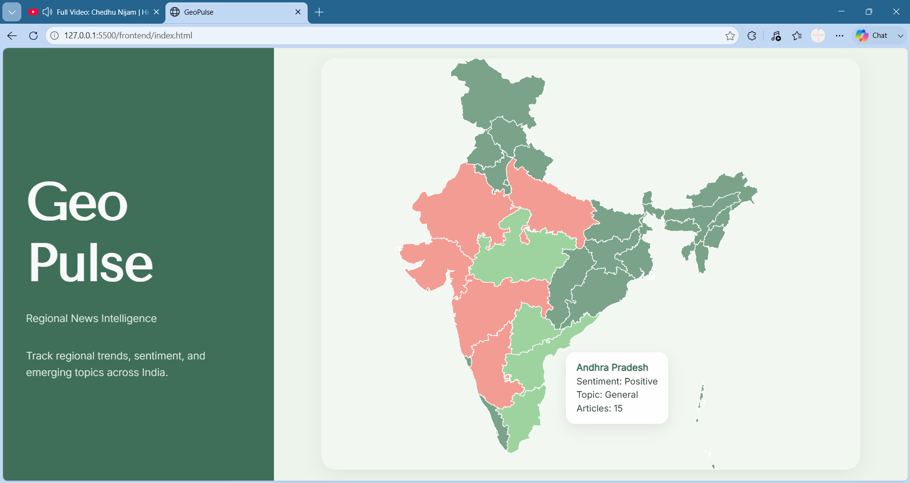
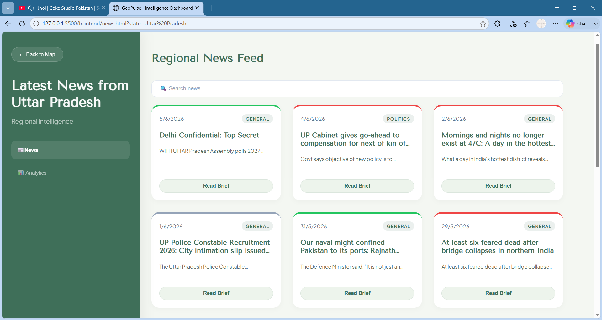
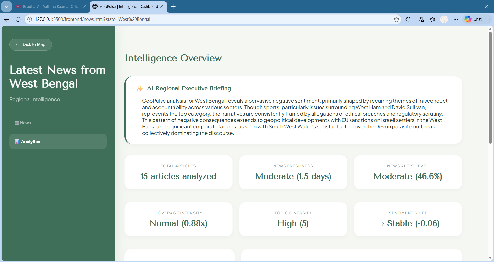
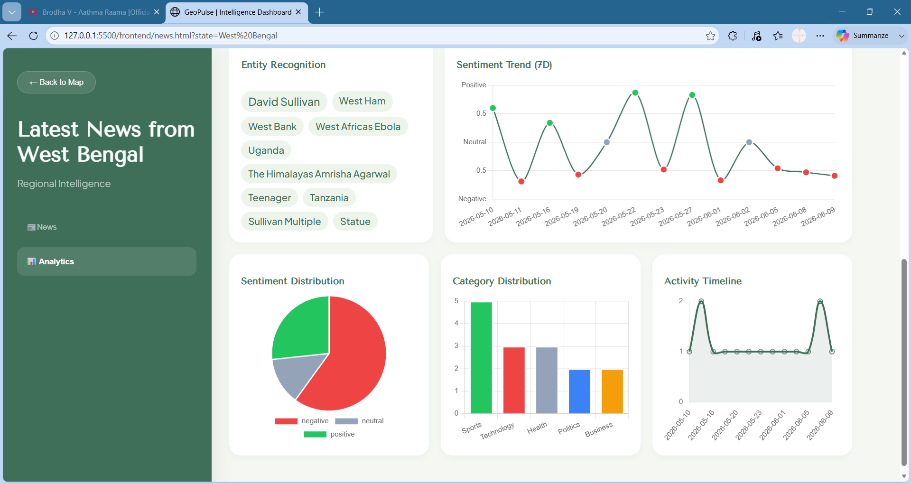

# GeoPulse


> An NLP-powered regional news intelligence platform that analyzes news across Indian states and presents interactive analytics through an intuitive dashboard.

---

## Overview

GeoPulse is a regional news intelligence platform that aggregates news articles, analyzes them using Natural Language Processing (NLP), and presents insights through an interactive dashboard.

The platform helps users explore regional news trends across Indian states using sentiment analysis, named entity recognition (NER), category classification, and AI-assisted executive briefings.

Rather than relying on an LLM to perform the analysis itself, GeoPulse first computes analytics through deterministic NLP pipelines and then uses an LLM to summarize those findings into concise executive briefings.

---

## Why GeoPulse?

Understanding regional news requires more than simply collecting headlines.

GeoPulse combines structured analytics with AI-assisted summarization to help users quickly understand:

- Regional news trends
- Sentiment across states
- Frequently mentioned people and organizations
- Category distribution
- Executive summaries of regional events

This approach keeps the analytics transparent while allowing the LLM to focus only on summarizing computed insights.

---

## Features

- 🗺️ Interactive India map
- 📰 Regional news feed
- 🔍 Keyword search
- 🏷️ Named Entity Recognition (NER)
- 😊 Sentiment analysis
- 📂 Category classification
- 📊 Interactive analytics dashboard
- 📈 Sentiment trend visualization
- 🥧 Category distribution charts
- ✨ AI-assisted executive briefing

---

## System Architecture

GeoPulse follows a modular NLP pipeline.

1. News articles are collected through the Currents API.
2. Articles undergo preprocessing and cleaning.
3. NLP pipelines perform Named Entity Recognition, sentiment analysis, and category classification.
4. Regional analytics are computed and aggregated.
5. Structured insights are passed to an LLM to generate an executive briefing.
6. Results are presented through an interactive dashboard.

---

## Tech Stack

| Category | Technologies |
|----------|--------------|
| Frontend | HTML5, CSS3, JavaScript |
| Backend | FastAPI, Python |
| Database | SQLite |
| NLP | spaCy, Hugging Face Transformers |
| AI | Gemini (Executive Briefing) |
| Visualization | Chart.js |
| APIs | Currents API |

---

## Analytics

GeoPulse provides several analytical views, including:

- Regional news distribution
- Sentiment trends
- Category distribution
- Named entity analysis
- Timeline visualization
- AI-assisted executive briefing

---

## Project Structure

```text
GeoPulse
│
├── backend/
│   ├── api/
│   ├── nlp/
│   ├── analytics/
│   └── database/
│
├── frontend/
│   ├── css/
│   ├── js/
│   ├── assets/
│   └── index.html
│
├── docs/
│
└── README.md
```

---

## Getting Started

### Clone the repository

```bash
git clone https://github.com/HrudyaSreech/GeoPulse.git
cd GeoPulse
```

### Backend

```bash
cd backend

pip install -r requirements.txt

uvicorn main:app --reload
```

### Frontend

The frontend is built with **HTML, CSS, and JavaScript**.

Simply open `frontend/index.html` in your browser **or** serve the frontend using a lightweight local server.

For example:

```bash
cd frontend

python -m http.server 8080
```

Then visit:

```
http://localhost:8080
```

---

## Design Trade-offs

- Articles rely on Currents API coverage; expanding to multi-source ingestion (planned) will improve regional specificity
- State-level attribution uses geographic metadata; a dedicated geographic classifier (planned) will improve accuracy
- Executive briefings summarize pre-computed analytics rather than generating them independently—this keeps results auditable


---

## Future Improvements

- Improve regional article attribution
- Confidence-based state classification
- Migrate from SQLite to PostgreSQL
- Multi-source news aggregation
- Historical trend analysis
- User authentication
- Scheduled news ingestion
- Cloud deployment

---

## Key Design Decisions

- **API-based ingestion** for structured and reliable news collection.
- **Deterministic NLP pipelines** for computing analytics.
- **LLM-assisted summarization** to generate executive briefings from computed insights.
- **Interactive visualizations** built with Chart.js.
- **FastAPI backend** to orchestrate data processing and analytics.

---
## Screenshots

## Screenshots

### Dashboard

<p align="center">
  
</p>

### State-wise News Dashboard

<p align="center">
  
</p>

### AI Executive Briefing

<p align="center">
  
</p>

### Analysis

<p align="center">
  
</p>
---

## Author

**Hrudyasree Ch**

Computer and Communication Engineering Student

Interested in Backend Development, NLP, Data Analytics, and AI Applications.
